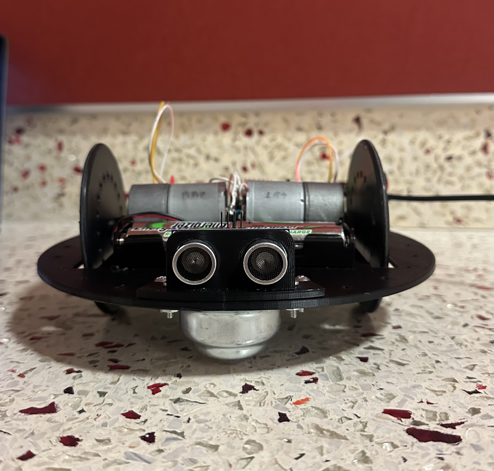

# Surveillance-Robot
1. This project involves creating a simple surveillance robot capable of being controlled via an IR remote and performing limited autonomous navigation. The robot integrates various sensors and components to achieve its functionality.
2. Managed power distribution by exclusively using a switched 4xAA NiMH battery source for motors and provided microcontroller power options, ensuring compliance with voltage specifications to prevent damage.
3. Utilized Microsoft Excel to calculate and calibrate distances based on ultrasonic sensor readings, ensuring precise navigation capabilities for the surveillance robot.
4. Enabled navigation with SR04 ultrasonic sensors and integrated TSOP13438 IR demodulator for command decoding, achieving robust functionality for surveillance operations.

  
  

